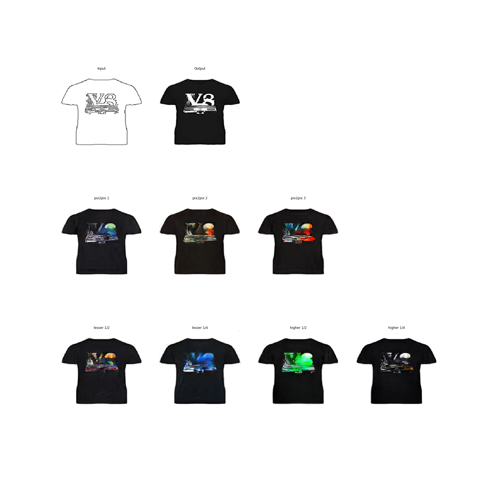

# MultiModeGAN

This is the code for work-in-progress research paper.
This work modifies pix2pix model and adds new loss as well as the new way to train it. Here is the comparison of our model (third line, last image) with the original pix2pix (second line):



## Setup

### Prerequisites

- Python3.6
- Tensorflow 1.8
- [Resnet v2 101 model](http://download.tensorflow.org/models/resnet_v2_101_2017_04_14.tar.gz) taken from [this page](https://github.com/tensorflow/models/tree/master/research/slim#Pretrained)

### Recommended
- Linux with GPU, CUDA and CuDNN installed.

## Running

After you downloaded the dataset, you can run the training with the next command:

`python3.6 pix2pix.py --mode train --output_dir train_checkpoint/ --max_epochs 200 --input_dir train/ --which_direction AtoB`

You can test the model with the next command:

`python3.6 pix2pix.py --mode test --checkpoint train_checkpoint/ --output_dir train_output --input_dir val`

The test run will produce `dataset_eval.json` file. It will contain the names of all samples and the respective ResNet loss.

You can see more examples in `train_script.sh` file, which contains the list of commands to repeat the experiment. 

## Datasets and Trained Models

The data format used by this program is the same as the original pix2pix format, which consists of images of input and desired output side by side like:


For example:


Some datasets have been made available by the authors of the pix2pix paper.  To download those datasets, use the included script `tools/download-dataset.py`.

| dataset | example |
| --- | --- |
| `python tools/download-dataset.py facades` <br> 400 images from [CMP Facades dataset](http://cmp.felk.cvut.cz/~tylecr1/facade/). (31MB) <br> Pre-trained: [BtoA](https://mega.nz/#!H0AmER7Y!pBHcH4M11eiHBmJEWvGr-E_jxK4jluKBUlbfyLSKgpY)  |  |
| `python tools/download-dataset.py cityscapes` <br> 2975 images from the [Cityscapes training set](https://www.cityscapes-dataset.com/). (113M) <br> Pre-trained: [AtoB](https://mega.nz/#!K1hXlbJA!rrZuEnL3nqOcRhjb-AnSkK0Ggf9NibhDymLOkhzwuQk) [BtoA](https://mega.nz/#!y1YxxB5D!1817IXQFcydjDdhk_ILbCourhA6WSYRttKLrGE97q7k) |  |
| `python tools/download-dataset.py maps` <br> 1096 training images scraped from Google Maps (246M) <br> Pre-trained: [AtoB](https://mega.nz/#!7oxklCzZ!8fRZoF3jMRS_rylCfw2RNBeewp4DFPVE_tSCjCKr-TI) [BtoA](https://mega.nz/#!S4AGzQJD!UH7B5SV7DJSTqKvtbFKqFkjdAh60kpdhTk9WerI-Q1I) |  |
| `python tools/download-dataset.py edges2shoes` <br> 50k training images from [UT Zappos50K dataset](http://vision.cs.utexas.edu/projects/finegrained/utzap50k/). Edges are computed by [HED](https://github.com/s9xie/hed) edge detector + post-processing. (2.2GB) <br> Pre-trained: [AtoB](https://mega.nz/#!u9pnmC4Q!2uHCZvHsCkHBJhHZ7xo5wI-mfekTwOK8hFPy0uBOrb4) |   |
| `python tools/download-dataset.py edges2handbags` <br> 137K Amazon Handbag images from [iGAN project](https://github.com/junyanz/iGAN). Edges are computed by [HED](https://github.com/s9xie/hed) edge detector + post-processing. (8.6GB) <br> Pre-trained: [AtoB](https://mega.nz/#!G1xlDCIS!sFDN3ZXKLUWU1TX6Kqt7UG4Yp-eLcinmf6HVRuSHjrM) |  |

The `facades` dataset is the smallest and easiest to get started with.

### Tips

You can look at the loss and computation graph using tensorboard:
```sh
tensorboard --logdir=train_checkpoint
```

  

If you wish to write in-progress pictures as the network is training, use `--display_freq 50`.  This will update `facades_train/index.html` every 50 steps with the current training inputs and outputs.

## Acknowledgments
This model is based on <a href="https://arxiv.org/pdf/1611.07004v1.pdf">Image-to-Image Translation Using Conditional Adversarial Networks</a>

